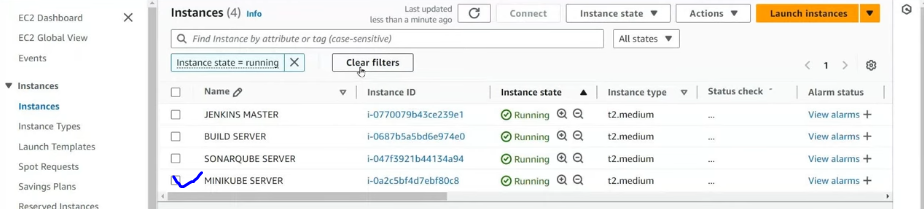
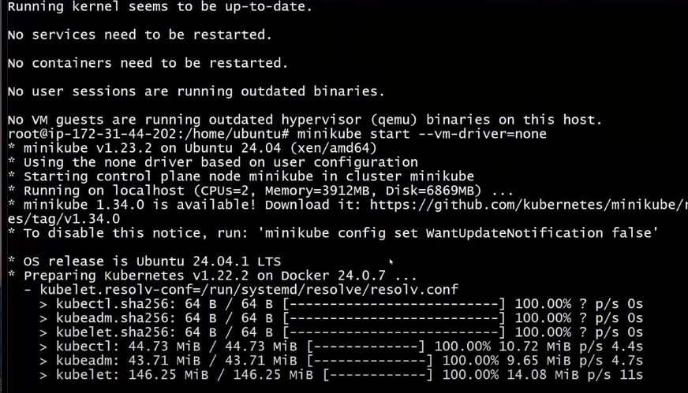
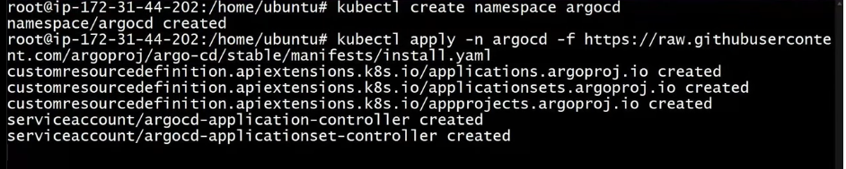
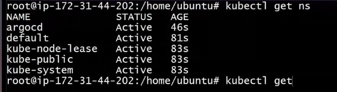
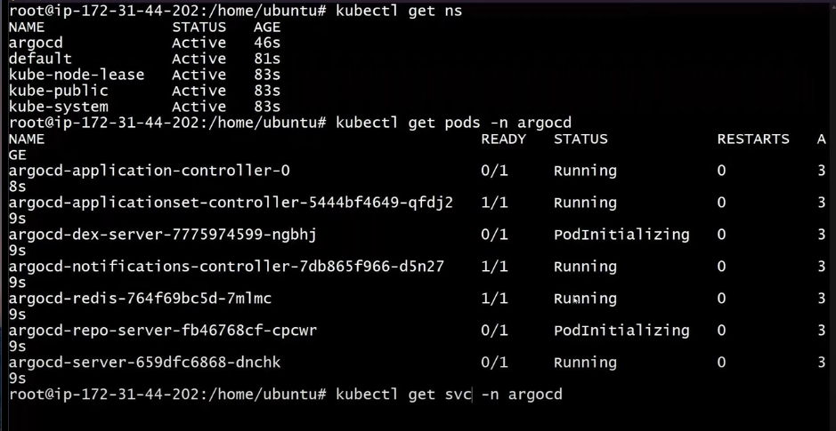
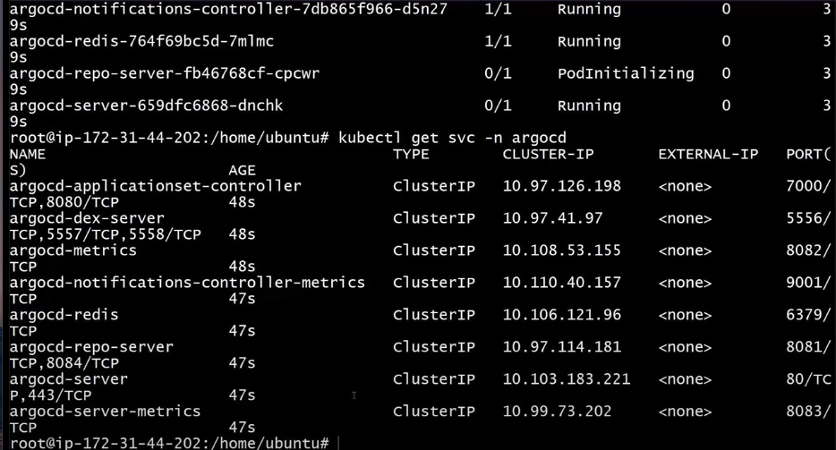
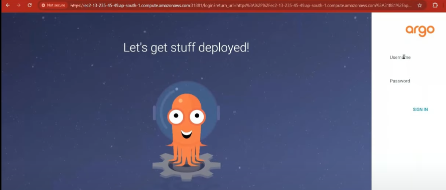
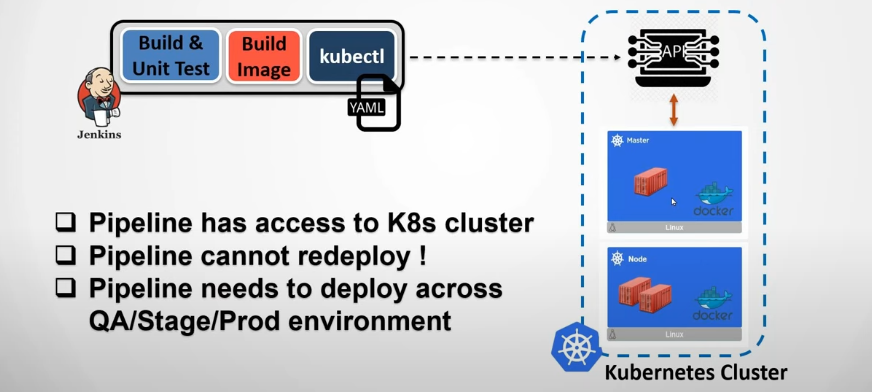
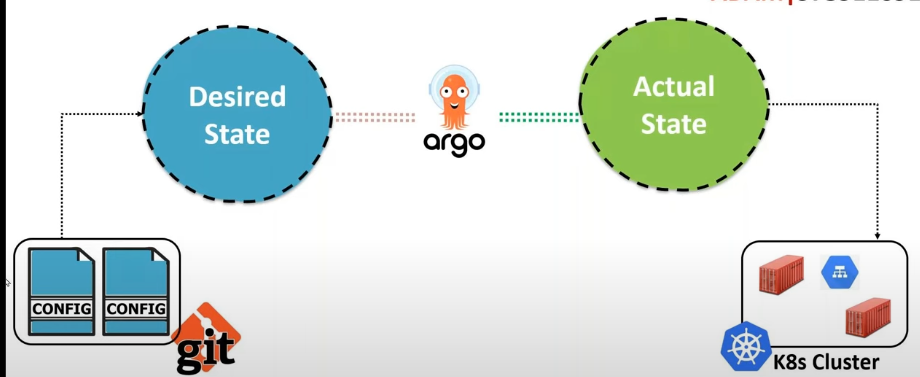

# PRODUCTION GRADE DEVSECOPS CICD PiPIPELINE

# Create 1 EC2 server

- Minikube server with 4 GB storage - t2.medium




# Setup Minikube

- $ Install Docker
- $ sudo apt update && sudo apt -y install docker.io

 ```sh
Install kubectl
$ curl -LO https://storage.googleapis.com/kubernetes-release/release/v1.23.7/bin/linux/amd64/kubectl && chmod +x ./kubectl && sudo mv ./kubectl /usr/local/bin/kubectl

 Install Minikube
$ curl -Lo minikube https://storage.googleapis.com/minikube/releases/v1.23.2/minikube-linux-amd64 && chmod +x minikube && sudo mv minikube /usr/local/bin/

 Start Minikube
$  sudo apt install conntrack
$  minikube start --vm-driver=none



Setup ArgoCD

$ kubectl create namespace argocd
$ kubectl apply -n argocd -f https://raw.githubusercontent.com/argoproj/argo-cd/stable/manifests/install.yaml
$ kubectl patch svc argocd-server -n argocd -p '{"spec": {"type": "NodePort"}}' 

For version 1.9 or later:
$ kubectl -n argocd get secret argocd-initial-admin-secret -o jsonpath="{.data.password}" | base64 -d && echo
```










# Traditional Deployment

Keep in mind that this way of doing is a big NO because:

- the Build machine will have access to the k8s cluster
- Pipeline cannot redeploy
- Pipeline needs to deploy accross QA/Stage/Prod environment



# GitOps

is a tool that allow me to specify my desired state and it will achieve so my actuall state can reflect my desired state using a git operator like argoCD



This approach is secure because i dont need a pipeline or a user to go through the kubectl command. So i keep my yml file which is my desired state and let the argocd to do the magic.


